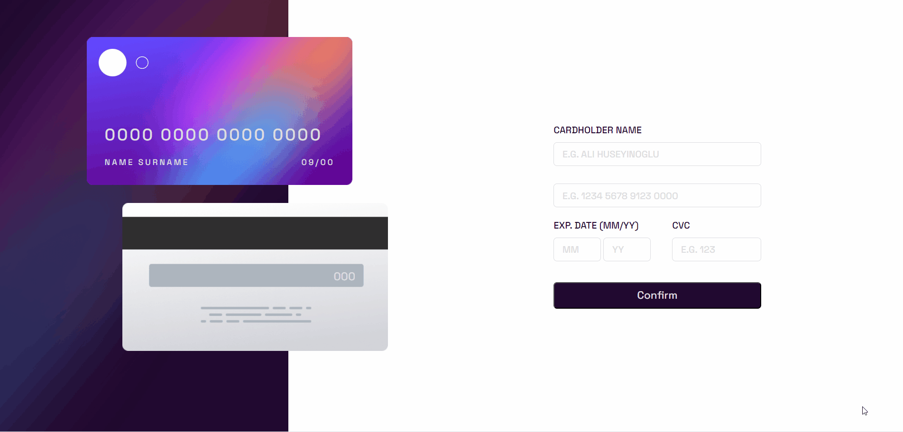

# Interactive-Card
- This challenge is taken from https://www.frontendmentor.io/chellanges
- This project is saving credit card informations with review layout.
- Responsive design
- Created by using html, css(scss), javascript, the template has flex system.
- <a href="src/screenshots"> See all screenshots </a>

# Screenshot  

   
# Gif

   

